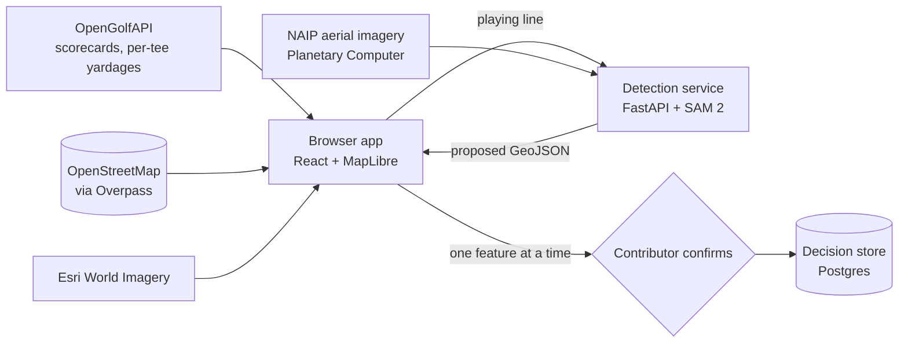

# OSM Course Mapper

Turn a golf course you know into accurate OpenStreetMap geometry, one hole at a time — without learning what a way is or what `golf=bunker` means.

Golf courses are among the worst-mapped common features in OpenStreetMap. Thousands have a `leisure=golf_course` outline and nothing inside it: somebody drew the boundary years ago and stopped, because tracing eighteen greens, fifty bunkers and every tee complex by hand in iD is hours of tedious work.

The people who could do it best are golfers who know one course intimately, and they are exactly the people existing OSM editors turn away. A golfer knows the seventh green has a false front and two bunkers left. They will not learn the `golf=*` tag vocabulary and have no opinion about whether a vertex sits two metres off.

This tool asks them golf questions instead. A contributor picks a US course, sees what OpenStreetMap already holds for it, draws the line each hole plays, and gets back proposed polygons for the green, tees, bunkers, water and fairway — segmented from public-domain aerial imagery. The course's own scorecard grounds the whole thing: it checks the line the contributor drew, and its pars and per-tee yardages tell the classifier what it is looking for.

## How it works



The contributor draws a hole's playing line — tee, any turn points, green. That line is the measurement the scorecard can check (measured *along* the path, because a dogleg's card does too) and the corridor the detection service reads. The service fetches NAIP imagery for a band around it, runs SAM 2 to enumerate every distinguishable region, classifies each one by its spectral signature and its position along the line, and returns WGS84 GeoJSON.

The review sequence then walks the contributor through one proposal at a time.

## Principles the code holds to

These are not aspirations — they are enforced in the code and pinned by tests.

**A machine proposal is never drawn as settled.** Proposals render amber and dashed, deliberately outside the mint palette used for what a human has confirmed, until that one feature is answered. The colour expression's fallback branch is the *pending* colour, so a status nobody enumerated cannot silently paint as human-approved. There is no batch confirm anywhere in the app. This is what keeps the tool a mapping assistant rather than a bot import under OSM's [Automated Edits code of conduct](https://wiki.openstreetmap.org/wiki/Automated_Edits_code_of_conduct).

**Detection is an offer, never a gate.** Proposals, "nothing here", a timeout and an outright failure are four different states the UI states plainly, and all four leave the hole mappable by hand.

**Nothing is invented.** A course OSM has no boundary for comes back absent rather than with a shape drawn for it. A hole that cannot be confidently identified draws no geometry at all — the wrong hole is worse than no hole. Absent numbers say they are absent instead of showing a default.

**Identification refuses rather than guesses.** The Pebble Beach bbox returns seven golf courses, so a course is adopted only on a confident name match or a centroid inside a tight ceiling. The same rule runs per hole: a club with three nines paired into three eighteens is matched by par sequence first, course name second, and nothing third.

**Nothing here writes to OpenStreetMap yet.** The upload path is deliberately not built. Contributor decisions — confirmed *and* rejected, with geometry, classified kind and imagery provenance — persist to a server-side store, so the record accumulates while the write path stays deferred.

## Repository layout

| Path | What lives there |
| --- | --- |
| `src/api/` | OpenGolfAPI client, Overpass lookup, detection client |
| `src/geo/` | WGS84 geometry and measurement. Pure functions, no React |
| `src/state/` | The one state hook driving every screen, and its pure `computeDerived` |
| `src/screens/` | Search, boundary, board, hole review, completion |
| `src/map/` | The shared MapLibre surface and imagery sources |
| `service/` | The Python detection service (see below) |
| `docs/plans/` | The plans this was built from — product scope, requirements, key decisions |

## Running it

The devcontainer builds on Python 3.11 with Node 22 and sets both up for you. Locally you need Node 18+ and Python 3.11–3.12 — the service pins Python that way on purpose, since a newer host means compiling GDAL and torch from source.

```bash
npm ci
npm run dev            # http://localhost:5173
```

The app works without the detection service — search, OSM adoption, imagery and playing lines all run browser-direct against public APIs that need no key. Only feature proposals need the service.

| Command | What it does |
| --- | --- |
| `npm run dev` | Vite dev server |
| `npm test` | Vitest — `node` for pure modules, `jsdom` for screens and state |
| `npm run smoke` | SSR-renders every screen and greps for the strings that must appear |
| `npm run typecheck` | `tsc -b --noEmit` |
| `npm run build` | Production build |

`npm run smoke` is worth knowing about: MapLibre touches browser globals on import, so every screen has to render without a `window`. The smoke build catches a regression there that unit tests do not.

### The detection service

```bash
python -m pip install -e './service[dev]'     # core: geometry, HTTP, persistence
python -m pip install -e './service[dev,segmentation]'   # adds torch + SAM 2 (multi-GB)
uvicorn service.app:app --reload              # http://localhost:8000
pytest service/ -m "not heavy"
```

The `segmentation` extra is split out on purpose: torch and segment-geospatial are gigabytes and only the segmentation step imports them, so the rest of the service installs and tests on a laptop without a GPU image. Tests are marked `heavy` (needs the extra and a model checkpoint) and `network` (reaches Planetary Computer or Postgres); neither is deselected by default, so skipping one is a visible choice.

| Endpoint | Purpose |
| --- | --- |
| `POST /v1/detect` | Start a detection job for a corridor. Returns `202` with a poll URL |
| `GET /v1/detect/{job_id}` | Poll it |
| `POST /v1/decisions` | Record what a contributor confirmed or rejected |
| `GET /v1/decisions/{course_id}` | Read them back |
| `GET /healthz` | Liveness |

Point the app at it with `VITE_DETECT_API_BASE`; the fallback is `http://localhost:8000`. The decision store reads `DATABASE_URL` and migrates with Alembic.

`service/modal_deploy.py` deploys it to [Modal](https://modal.com) on an A10G, with the SAM 2 checkpoint (`facebook/sam2-hiera-large`) baked into the image at build time rather than downloaded per cold start.

## Data and licensing

| Source | Licence | Used for |
| --- | --- | --- |
| [OpenGolfAPI](https://opengolfapi.org) | ODbL 1.0 | Course records, scorecards, per-tee yardages |
| [OpenStreetMap](https://www.openstreetmap.org) via Overpass | ODbL 1.0 | Existing boundaries, holes and landmarks |
| [NAIP](https://planetarycomputer.microsoft.com/dataset/naip) via Planetary Computer | Public domain | The imagery detection reads |
| Esri World Imagery | Esri terms | The basemap a contributor looks at |

Every map surface credits the pixels actually on screen, and the review rail carries each proposal's NAIP acquisition year — with a warning past three years, since a course can rebuild a green without the model having any way to know.

## Status

Working end to end from search through per-feature confirmation, with decisions persisted. **The OpenStreetMap write path is not built** — nothing uploads. That is the next slice.

Two known rough edges: the Overpass query returns ~250 KB on a dense club against an 8-second budget, so busy periods will report "we could not check OpenStreetMap" more often than a quiet course does; and detection quality varies with what NAIP happened to see.
