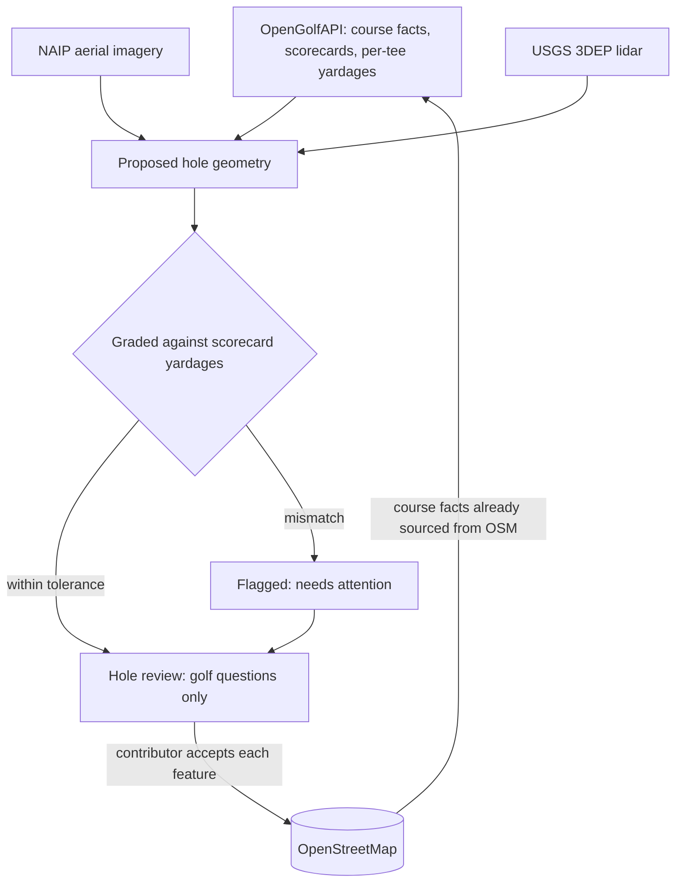
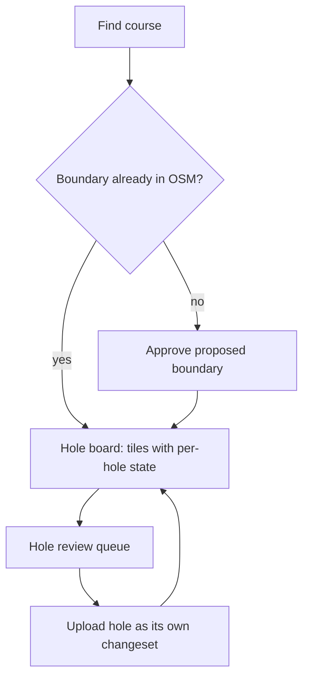

# OSM Golf Course Mapper - Plan

## Goal Capsule

- **Objective:** Let a golfer with no GIS or OSM experience turn a course they know into accurate OpenStreetMap golf geometry, one hole at a time, by reviewing AI-proposed features that have already been graded against the course scorecard.
- **Product authority:** Product scope, actors, flows, and boundaries in this document are settled. Detection model choice, persistence, and service topology are planning decisions.
- **Open blockers:** The provenance of OpenGolfAPI's scorecard data is unconfirmed, which decides whether `par` and `handicap` may be written to OSM as tags or used for validation only. Planning can proceed; the answer changes R16 and one Key Decision, nothing structural.

---

## Product Contract

### Summary

A desktop web tool where a contributor picks a US golf course, approves a detected course boundary, then works through a board of hole tiles. Each hole arrives with tees, green, bunkers, water hazards, and fairway already proposed from aerial imagery and pre-checked against the scorecard, so review is a short sequence of golf questions rather than polygon editing. Each finished hole uploads to OpenStreetMap as its own changeset under the contributor's account.

### Problem Frame

Golf courses are among the most poorly mapped common features in OpenStreetMap. Thousands of courses have a `leisure=golf_course` boundary and nothing inside it — someone drew the outline years ago and stopped, because tracing eighteen greens, fifty bunkers, and every tee complex by hand in iD is hours of tedious work that only a dedicated mapper will do.

The people who could do it best are golfers who know a specific course intimately, and they are exactly the people existing OSM editors turn away. A golfer knows the seventh green has a false front and two bunkers left. They do not know what a way is, will not learn the `golf=*` tag vocabulary, and have no opinion about whether a vertex sits two meters off. Every current path to contributing demands the second kind of knowledge and wastes the first.

Meanwhile the reference data that would make automated detection reliable already exists and is already open. OpenGolfAPI publishes ODbL-licensed scorecards for 16,274 US courses — par, handicap index, and yardage from every tee set — with its geometry fields (`green_polygon`, `fairway_polygon`, `tee_coords`, `hazards`) entirely empty. Public-domain NAIP imagery resolves golf features cleanly. Nobody has connected the two.

### Key Decisions

- KD1. **Course board with hole-level units.** (session-settled: user-directed — chosen over a hole-task feed and a free-form canvas: a contributor's local knowledge is only worth something on courses they know.) Governs R1, R12, R17.
- KD2. **The human owns golf semantics; detection owns geometry.** Review asks which feature is the green and whether a bunker is missing, not whether an outline is correct. (session-settled: user-approved — chosen over vertex-level correction, which loses non-technical contributors.) Governs R9, R10.
- KD3. **The scorecard is ground truth and grades detection before a human sees it.** Known par and per-tee yardages turn geometry into a checkable claim, so most holes reach review pre-validated. Governs R6, R7, R8.
- KD4. **The course boundary is approved explicitly before any hole work.** (session-settled: user-directed — chosen over silently committing a detected boundary: the boundary determines which holes belong to the course.) Governs R2, R3.
- KD5. **Per-feature human acceptance, always.** This is what keeps the tool a mapping assistant rather than a bot import under OSM's Automated Edits code of conduct. Governs R11, R14.
- KD6. **Build for a small trusted pool.** A handful of motivated contributors is the expected population, so there is no incentive layer, no moderation queue, and no acquisition surface. (session-settled: user-directed — chosen over designing for mass contribution.)
- KD7. **No collision or locking handling.** Duplicate-edit risk is accepted at this user count; deriving hole state from OSM limits the blast radius. (session-settled: user-directed — chosen over a claim or lease layer.) Governs R18.
- KD8. **Core playable geometry only.** Tees, green, bunkers, water hazards, fairway — not rough, cart paths, driving range, or pins. (session-settled: user-directed.) Governs R5.
- KD9. **Desktop web only.** Reviewing and correcting geometry over aerial imagery needs a pointer and a large map. (session-settled: user-directed — chosen over mobile-first and responsive.)
- KD10. **Scorecard facts ground detection but are not written to OSM as tags.** Provenance is unconfirmed and OSM is unforgiving about it; this reverses if provenance clears. Governs R16.

How the open data flows, and why the loop closes:

### Actors

- A1. **Contributor** — a golfer with local knowledge of a specific course, no OSM or GIS expertise, and an OSM account created during onboarding if they lack one.
- A2. **Detection service** — proposes hole geometry from imagery and elevation, constrained by scorecard facts, and grades its own output before review.
- A3. **OpenStreetMap** — the system of record for accepted geometry, and the source of truth for what is already mapped.
- A4. **OpenGolfAPI** — upstream source of course records and scorecards, and downstream consumer of the geometry once it lands in OSM.

### Requirements

**Course setup and boundary**

- R1. A contributor finds a course by name or location from OpenGolfAPI's US course records.
- R2. When the selected course has no `leisure=golf_course` polygon in OSM, the tool proposes one and requires explicit human approval before any hole work begins.
- R3. Boundary approval presents checkable evidence alongside the polygon: detected hole count reconciled against the scorecard's hole count, enclosed area, and whether known landmarks fall inside or outside.
- R4. When the course already has a boundary in OSM, the tool adopts it unchanged and proposes no edits to it.

**Detection and scorecard grounding**

- R5. For each hole, the tool proposes tee boxes, the green, bunkers, water hazards, and the fairway.
- R6. Scorecard facts constrain detection: par constrains hole shape, per-tee yardages constrain the tee-to-green playing line, and hole count constrains how many holes must be found.
- R7. Each proposed hole is graded against its scorecard yardages before a human sees it, and holes whose measured playing line falls outside tolerance are flagged as needing attention.
- R8. Detected tee boxes are matched to tee sets by their position along the playing line, compared against the scorecard's per-tee yardages.
- R9. Water is classified as a hazard only by human answer, because whether a body of water is in play is a golf judgment rather than a visual one.

**Hole review**

- R10. Review presents golf questions — feature identity, missing features, hazard classification — and offers geometry correction only as an escape hatch.
- R11. Every proposed feature requires an explicit human accept, fix, or reject before it can reach OSM.
- R12. A contributor may finish and upload a single hole without any course-level completion requirement.
- R13. A contributor may leave a hole mid-review without losing features already accepted on it.

**Upload to OSM**

- R14. Each completed hole uploads as its own changeset under the contributor's own OSM account via OAuth.
- R15. Each changeset carries a `created_by` tag identifying the tool and a comment naming the course and hole number.
- R16. Features are written using OSM's existing golf schema, the tool invents no tags, and scorecard-derived facts such as `par` and `handicap` are not written to OSM.

**Progress and resumability**

- R17. The course board shows each hole's state: unmapped, drafted and awaiting review, needs attention, or complete.
- R18. Hole state is derived from what exists in OSM plus local review progress, so a hole mapped elsewhere by anyone shows as complete.
- R19. A contributor can leave a course and return without losing accepted work that has not yet uploaded.

### Key Flows

- F1. First hole on an unmapped course
  - **Trigger:** A1 selects a course with no `leisure=golf_course` polygon in OSM.
  - **Actors:** A1, A2, A3
  - **Steps:** A2 proposes a boundary; A1 approves it against the reconciliation evidence; the board opens with all holes unmapped; A1 opens hole 1 and reviews its proposed features; the hole uploads.
  - **Outcome:** The course exists in OSM with one complete hole.
  - **Covered by:** R2, R3, R5, R11, R12, R14
- F2. Reviewing a pre-validated hole
  - **Trigger:** A1 opens a hole whose proposed geometry passed the scorecard grading.
  - **Actors:** A1, A2, A3
  - **Steps:** The map frames the hole with all proposed features drawn; A1 confirms the green, answers whether any bunkers are missing, classifies any water, and confirms tee assignments; the hole uploads.
  - **Outcome:** A hole reaches OSM without A1 touching any geometry.
  - **Covered by:** R7, R8, R9, R10, R11, R14
- F3. Hole flagged by scorecard mismatch
  - **Trigger:** A hole's measured playing line falls outside tolerance against its scorecard yardages.
  - **Actors:** A1, A2
  - **Steps:** The board marks the hole as needing attention; review opens on the likely cause — a green or tee placed on the wrong hole; A1 corrects the identification or repositions the feature; grading reruns.
  - **Outcome:** The hole either passes and uploads, or A1 leaves it flagged for later.
  - **Covered by:** R7, R10, R13, R17

### Acceptance Examples

- AE1. **Covers R7.**
  - **Given:** Hole 1 plays 378 yards from the blue tees per the scorecard.
  - **When:** Detection proposes a tee and green producing a 250-yard playing line.
  - **Then:** The hole is flagged as needing attention before review, and the board tile reflects that state.
- AE2. **Covers R8.**
  - **Given:** A hole has scorecard yardages of 310, 328, 337, 349, and 378 from five tee sets, and detection found four tee polygons.
  - **When:** Tee matching runs.
  - **Then:** Each detected tee is assigned the tee set whose yardage best matches its position along the playing line, and the unmatched tee set is surfaced as a possible missing tee rather than silently dropped.
- AE3. **Covers R4.**
  - **Given:** The selected course already has a `leisure=golf_course` polygon in OSM.
  - **When:** The contributor opens the course.
  - **Then:** No boundary approval step appears and the existing boundary is left untouched.
- AE4. **Covers R9.**
  - **Given:** Detection finds a body of water adjacent to the fairway.
  - **When:** The contributor reaches it in review.
  - **Then:** They are asked whether it is in play, and the feature is tagged as a hazard only if they say yes.
- AE5. **Covers R12, R18, R19.**
  - **Given:** A contributor completed holes 1 through 3 and someone else mapped hole 7 directly in another editor.
  - **When:** The contributor returns to the course board.
  - **Then:** Holes 1 through 3 and hole 7 all show as complete, and the remaining holes stay available.

### Scope Boundaries

**Deferred for later**

- On-course capture — GPS traces and tapped waypoints collected while playing a round.
- Mobile web, including a semantics-only review flow sized for a phone.
- The deeper OSM golf tags: rough, cart paths, driving range, clubhouse, and pins.
- Courses outside the United States, which have neither scorecard coverage nor the public-domain imagery and elevation inputs.

**Outside this product's identity**

- Contribution incentives, leaderboards, badges, or any growth mechanic.
- Moderation queues, contributor reputation, or review of one contributor's work by another.
- Collision detection or hole locking.
- A direct write path into OpenGolfAPI — OSM is the write target, and OpenGolfAPI picks geometry up downstream.
- A general-purpose OSM editor. Anything outside golf geometry belongs in iD, Rapid, or JOSM.

### Dependencies / Assumptions

- OpenGolfAPI at `api.opengolfapi.org` serves course records and scorecards under ODbL 1.0 with no key required for reads. Verified against `/v1/courses/search` and `/api/v1/courses/{id}` on 2026-08-11.
- OpenGolfAPI's per-hole geometry fields (`tee_coords`, `green.center`, `green_polygon`, `fairway_polygon`, `hazards`) are currently empty, which is what makes this tool's output valuable downstream. Verified on 2026-08-11.
- Esri World Imagery, Esri Clarity, Bing, and Mapbox all grant tracing rights for OSM and are available as base layers. Maxar revoked OSM API access in 2023 and is not available.
- NAIP is public domain, which permits server-side inference and redistribution that the licensed base layers do not.
- USGS 3DEP lidar is assumed to improve bunker and green detection, since bunkers are depressions and greens are flat platforms. This is unvalidated and may not earn its complexity.
- OpenGolfAPI exposes no OSM identifier on its course records, so courses must be matched to OSM entities by coordinate and name. Verified against its OpenAPI schema on 2026-08-11.
- Geometry pushed to OSM reaches OpenGolfAPI eventually: its attribution page names OpenStreetMap as the source for course discovery, coordinates, boundaries, and hole and hazard geometry. The refresh cadence is unknown.
- Contributors are assumed willing to create an OSM account, since changesets must be attributed to a real person for the Automated Edits code of conduct position to hold.

### Outstanding Questions

**Resolve Before Planning**

None. The scorecard-provenance gap below is covered by KD10's conservative default, so planning is not held on it.

**Deferred to Planning**

- What yardage deviation should flag a hole under R7? Start at 10% of the matched tee-set yardage and calibrate against real courses; the threshold is the main lever on how much contributor effort the tool costs.
- How courses are matched between OpenGolfAPI and OSM, given no shared identifier — coordinate proximity, name similarity, or both with a confidence threshold.
- Detection model selection, and whether lidar is fused with imagery or used only as a disambiguation pass.
- Where accepted-but-unuploaded work persists, and for how long.
- How the course board is seeded — an Overpass query against OSM, an OpenGolfAPI lookup, or both.
- Whether boundary proposal reuses the same detection path as hole features or a separate one.

**Watch item, not a blocker**

- OpenGolfAPI's scorecard layer has no documented source. Its attribution page names eleven sources, none of which plausibly supplies par, handicap index, and per-tee yardages for 16,274 courses. KD10 already holds those facts out of OSM, so nothing is blocked — but that default should not be relaxed until someone can answer where the scorecards came from.

### Sources / Research

- [Key:golf](https://wiki.openstreetmap.org/wiki/Key:golf) and [Tag:golf=hole](https://wiki.openstreetmap.org/wiki/Tag:golf=hole) — the tag vocabulary this tool writes and hides from contributors.
- [Tag:leisure=golf_course](https://wiki.openstreetmap.org/wiki/Tag:leisure=golf_course) — the course container, and the spatial-containment relationship that makes R2 load-bearing.
- [Automated Edits code of conduct](https://wiki.openstreetmap.org/wiki/Automated_Edits_code_of_conduct) — governs edits made without individual consideration of each change, which is why R11 exists.
- [Rapid](https://wiki.openstreetmap.org/wiki/Rapid) — the accepted precedent for AI-proposed geometry in OSM: suggestions render distinctly and only accepted features upload.
- [Esri World Imagery in OpenStreetMap](https://www.esri.com/arcgis-blog/products/constituent-engagement/constituent-engagement/esri-world-imagery-in-openstreetmap) — explicit tracing grant.
- [OpenGolfAPI](https://opengolfapi.org/) — 16,800+ US courses, 16,274 with scorecards, ODbL 1.0.
- [OpenGolfAPI attribution](https://opengolfapi.org/attribution) — names OSM as the source for hole and hazard geometry, and documents no source for the scorecard layer.
