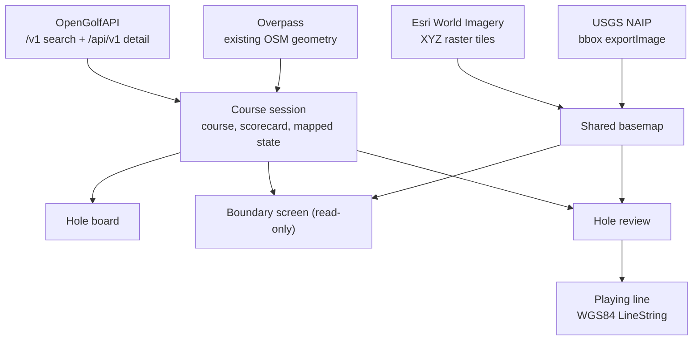
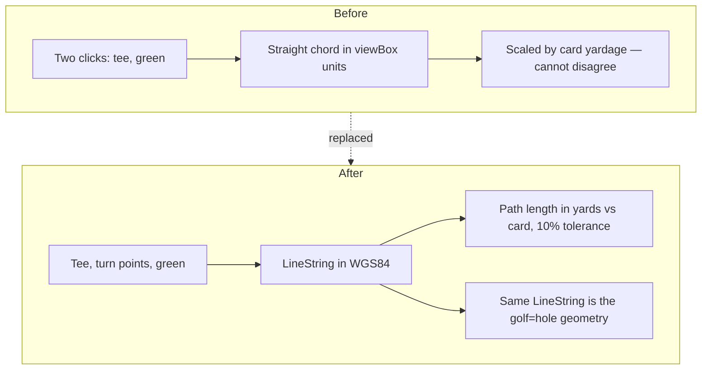

# Live Course Data and Real Imagery - Plan

## Goal Capsule

- **Objective:** Replace the app's two largest fixtures with live sources — course data from OpenGolfAPI, aerial imagery from Esri World Imagery — move hole geometry into real geographic coordinates, and let a contributor draw the hole's playing line.
- **Product authority:** `docs/plans/2026-08-11-001-feat-osm-golf-course-mapper-plan.md` owns product scope for the whole tool and stays at `requirements-only`. This plan implements a slice of it and does not widen that scope.
- **Scope boundary:** AI detection and the OpenStreetMap write path stay out. Nothing in this plan uploads to OSM.
- **Stop conditions:** Stop and ask if the playing-line change would alter what a review step asks the contributor, or if Esri tiles stop serving with open CORS.
- **Tail ownership:** No branch, PR, or deploy is in scope. The repo is not yet a git repository.

---

## Product Contract

### Summary

Search resolves against OpenGolfAPI instead of a four-item fixture, selecting a course loads its real scorecard, and both map screens render real aerial imagery. Hole geometry moves into WGS84, and the contributor draws the hole's playing line — tee, any turn points, green — which is both the measurement the scorecard can check and the shape OSM stores as `golf=hole`.

### Problem Frame

The app currently works end-to-end against a single hardcoded course. `COURSES` holds four Pebble Beach-area entries filtered client-side. `PARS`, `YDS`, and `INDEX` hold Pebble Beach's card. Two hand-drawn SVG components stand in for aerial imagery, and every proposed feature is a path string in a fixed viewBox that has no relationship to the earth.

That fixture proved the interaction shape and hides two problems. A contributor cannot map a course that is not Pebble Beach. And because shapes live in drawing-space, nothing the contributor confirms can become an OpenStreetMap feature — OSM needs coordinates.

Both problems share a root: the app has no geographic model. Swapping the background image alone would not fix it, because the overlay, the click handler, and the yardage check all measure in viewBox units.

The yardage check is where that bites hardest. Today it multiplies a viewBox distance by the ratio of the card's yardage to a hardcoded constant, so the measurement is derived from the answer it is checked against and can never disagree. Making it real requires measuring the line a ball actually travels, which on a dogleg is not the straight line between tee and green.

### Requirements

**Course data**

- R1. Course search queries OpenGolfAPI and returns live results, replacing the local fixture list. (origin R1)
- R2. Search tolerates the API's real data shape: absent `city`, `state`, and `par`, and loose result ranking.
- R3. Search results carry no mapping-progress indicator, because OpenGolfAPI exposes no field that could supply one.
- R4. Selecting a course loads its detail record and drives the board and review screens from that course's real par, handicap index, and per-tee yardages.
- R5. Course requests degrade visibly: a failed or empty search, and a failed detail fetch, each state what happened rather than rendering an empty surface.
- R13. Search results are filtered to United States courses, because OpenGolfAPI serves worldwide records while the product's scorecard, imagery, and elevation inputs are US-bound.
- R17. Two results that share a name remain visually distinguishable even when both lack a city and state.

**Imagery and coordinates**

- R6. Both map screens render real aerial imagery for the selected course's location.
- R7. Proposed features, contributor clicks, and marked points are stored as WGS84 coordinates.
- R9. The imagery layer names its source and capture context on screen, and the source is swappable without touching screen code.
- R18. The course data's ODbL attribution is displayed alongside the imagery attribution.
- R19. When imagery fails to load, the map states so and suppresses click-to-place rather than accepting clicks over a blank canvas.

**Playing line**

- R8. The contributor draws a hole's playing line as tee, any number of turn points, then green; its measured length is compared against that hole's scorecard yardage.
- R14. The playing line is stored as an ordered WGS84 LineString, the geometry OpenStreetMap holds for `golf=hole`.
- R15. A hole's measurement is compared against the yardage of the tee set the contributor started from, not a fixed tee.

**Mapped state**

- R10. A selected course's existing OpenStreetMap geometry determines which holes show as already mapped. (origin R18)
- R11. When OpenStreetMap already holds a course boundary, the tool adopts it and presents it for orientation without asking for approval. (origin R4)
- R12. OpenStreetMap queries tolerate failure: a timeout or error leaves the course usable rather than blocking it.
- R16. Unmapped and unknown are distinct hole states — a failed OSM lookup never renders as zero holes mapped.

### Key Flows

- F1. Search and open a real course
  - **Trigger:** Contributor types a course name.
  - **Steps:** Debounced query to OpenGolfAPI, filtered to US results; selection loads the detail record and queries OSM for existing geometry, with both stages visible; the board opens seeded from what OSM holds.
  - **Covered by:** R1, R2, R3, R4, R5, R10, R11, R12, R13, R16, R17
- F2. Draw a hole's playing line on real imagery
  - **Trigger:** Contributor opens a hole with no existing geometry.
  - **Steps:** Real imagery frames the course; the contributor clicks the tee, adds turn points where the hole bends, and clicks the green; the line's length is measured in yards and checked against the scorecard.
  - **Outcome:** A measured playing line the contributor can accept, with a real yardage verdict.
  - **Covered by:** R6, R7, R8, R9, R14, R15, R19

### Acceptance Examples

- AE1. **Covers R2, R17.**
  - **Given:** Two search results share a course name and both have null `city`, `state`, and `par`.
  - **When:** The result list renders.
  - **Then:** Neither row shows empty separators or the literal text "null", and the two rows carry different secondary text.
- AE2. **Covers R8, R15.**
  - **Given:** A dogleg hole playing 378 yards from the back tee.
  - **When:** The contributor marks the tee, one turn point at the corner, then the green.
  - **Then:** The measured length follows the two segments and reads within tolerance of 378 — where a straight tee-to-green line would have read short.
- AE3. **Covers R11.**
  - **Given:** A course whose boundary already exists in OpenStreetMap.
  - **When:** The contributor opens it.
  - **Then:** The boundary renders over imagery with its acreage and hole count, no approve or reject control appears, and a single action continues to the board.
- AE4. **Covers R12, R16.**
  - **Given:** The Overpass endpoint times out.
  - **When:** The contributor opens a course.
  - **Then:** The board still opens, mapped state reads as unknown rather than zero, the header shows no numeric count, and the failure is stated.
- AE5. **Covers R5.**
  - **Given:** A search that matches nothing, and separately a detail fetch that fails.
  - **When:** Each occurs.
  - **Then:** The no-matches state and the load-failure state are each distinct from the loading state, and a failed detail fetch leaves the contributor on search rather than opening an empty board.
- AE6. **Covers R13.**
  - **Given:** A search whose raw API response is mostly non-US courses.
  - **When:** Results render.
  - **Then:** Only US courses appear, and a result set emptied entirely by the filter reads as no matches rather than as a failure.

### Scope Boundaries

**Deferred to follow-up work**

- AI detection of greens, tees, bunkers, water, and fairway (origin R5–R9). Until it lands, the playing-line flow is the only path that produces real geometry, and the accept/reject review sequence stays built but unexercised.
- OSM OAuth and changeset upload (origin R14–R16).
- Vertex-level geometry editing — the "edges look off, let me drag them" escape hatch stays a stub.
- Real per-hole thumbnail imagery on the board; tiles keep generated placeholder art.
- Non-US courses. R13 filters them out; the filter is the seam where support would be added.

**Outside this plan**

- Any backend, proxy, or server component. Every request in this plan is browser-direct.
- Demo or fixture geometry of any kind. No synthetic shapes are introduced over real courses.

### Dependencies / Assumptions

- OpenGolfAPI at `api.opengolfapi.org` serves with `access-control-allow-origin: *` and no key. Verified 2026-08-12. `limit` is honored; `per_page` is ignored; default page size is 20.
- **The two base paths return different records and are not interchangeable.** Verified 2026-08-12: `/v1/courses/{id}` returns `scorecard: [{hole, par}]` with no `tees` and no `holes_data`; `/api/v1/courses/{id}` returns `tees` and `holes_data[].yardages` plus `handicap_index`. Per-tee yardages exist only on the `/api/v1` shape. The two also name coordinates differently — `latitude`/`longitude` on `/v1`, `lat`/`lng` on `/api/v1`.
- `tees[].tee_key` is gendered (`blue-male`, `gold-female`); `holes_data[].yardages` is keyed by bare color (`blue`, `gold`, plus a stray `web`). Joining the two needs an explicit rule.
- **OpenGolfAPI is not US-only.** Verified 2026-08-12: a search for "golf" returned 19 of 20 results outside the US — Dubai, Northern Ireland, Orkney, Austria, Argentina. Non-US records are where null `city`/`state`/`par` values cluster.
- `city` is null on most records — 40 of 50 and 47 of 50 in two samples on 2026-08-12.
- Every record sampled carries coordinates — 0 missing across 165 records. Coordinate *precision* is unverified: the value may be a property centroid, a clubhouse point, or a geocoded address.
- Every response carries `_license: "ODbL-1.0"` and an `_attribution` string.
- Esri World Imagery tiles serve with `access-control-allow-origin: *` and no key. Verified 2026-08-12 against a Pebble Beach tile: HTTP 200, `image/jpeg`, 256×256. ArcGIS orders the tile path `{z}/{y}/{x}`.
- USGS NAIPPlus `exportImage` serves 0.3 m public-domain imagery with `access-control-allow-origin: *` and no key. Verified 2026-08-12: HTTP 200, `image/jpeg`, EPSG:3857 native, `tileInfo` absent — hence bbox templating rather than XYZ.
- The USDA APFO NAIP endpoint (`gis.apfo.usda.gov`) resolves but fails its TLS handshake from two independent networks. Do not build on it.
- Overpass sends `access-control-allow-origin: *` but is unreliable. Three consecutive calls on 2026-08-12 returned a 504, an empty reply, then a 200. That sample is too small to size a retry budget confidently.
- **Course boundaries are often relations, not ways.** Verified 2026-08-12: the Pebble Beach bbox returns Pebble Beach and Poppy Hills as relations, and five neighbors as ways. A way-only query misses multipolygon-mapped courses.
- Real courses are frequently mapped already — the Pebble Beach bbox holds 35 `golf=hole` ways covering refs 1–18. "Already mapped" is a common path, not an edge case.

### Open Questions

**Deferred to implementation**

- How the course session reaches screens — explicit props from `src/App.tsx`, context, or a module store. The SSR smoke harness construction depends on the answer.
- Whether the playing line should snap turn points to the fairway centerline once detection exists.
- Whether a contributor can reject an adopted OSM boundary that is wrong or incomplete. R11 adopts unconditionally; no rejection path exists until detection can propose an alternative.

### Sources / Research

- [OpenStreetMap Editor Layer Index](https://github.com/osmlab/editor-layer-index) — machine-readable per-source `permission_osm`, tile URLs, and attribution. Esri World Imagery is `explicit`.
- [Esri World Imagery uses permitted](https://www.arcgis.com/home/item.html?id=8e90a00a0a6845a49262e0b756f57a10) — the tracing grant text.
- [OSM wiki: Tag:golf=hole](https://wiki.openstreetmap.org/wiki/Tag:golf=hole) — the hole is a way along the playing path from tee to green, which is what R14 produces.
- [MapLibre GL JS](https://maplibre.org/maplibre-gl-js/docs/) — raster source configuration, `unproject`, `queryRenderedFeatures`, source `error` events.
- [Turf.js](https://turfjs.org/) — `@turf/length` for path distance, `@turf/area` for acreage.
- [OpenGolfAPI attribution](https://opengolfapi.org/attribution) — ODbL 1.0 and the required attribution string.

---

## Planning Contract

### Key Technical Decisions

- KTD1. **Esri World Imagery as the default basemap.** (session-settled: user-directed — chosen over public-domain USGS NAIP: the tool is permanently free and non-commercial, so the commercial-use clause that would have ruled Esri out does not apply, and Esri's cached tiles reach zoom 22 against NAIP's ~18.) Governs R6, R9.
- KTD2. **NAIP ships as a working second source.** USGS NAIPPlus renders per request via `exportImage` rather than serving cached tiles, so U6 carries two raster mechanisms. Selection is configuration-level, not a contributor-facing control. Governs R9.
- KTD3. **Two hardcoded sources, not the Editor Layer Index.** ELI would make the licensing posture auditable, but it costs a fetch plus coverage-polygon filtering to choose between two entries. Revisit at a third source. Governs R9.
- KTD4. **Detection input imagery is a separate decision from the display basemap.** Esri's grant covers tracing in an editor, not server-side inference; the origin routes detection from public-domain NAIP. KTD1 governs display only and must not be read as choosing detection's input.
- KTD5. **MapLibre GL JS for the map surface, loaded lazily.** Raster XYZ needs one source declaration, `unproject` converts clicks to coordinates, and `queryRenderedFeatures` gives hit-testing. MapLibre touches browser globals at import, so the component renders a static placeholder when `window` is undefined and imports the library inside an effect — otherwise the SSR smoke build dies at module load. Governs R6, R7, R19.
- KTD6. **Geometry becomes GeoJSON in WGS84.** `SHAPES`, `ell`, `rr`, `corridorPath`, and `REVIEW_DIAGONAL` are replaced rather than adapted. Governs R7, R8, R14.
- KTD7. **Yardage is measured along the contributor-drawn playing line, not tee-to-green.** A scorecard yardage follows the playing path, so a straight chord reads short on any dogleg and would fail correct input. `@turf/length` over the LineString is the like-for-like comparison, and the same LineString is the `golf=hole` geometry. Governs R8, R14.
- KTD8. **Tolerance is 10% of the matched tee-set yardage.** The origin proposed this starting value. It replaces the flat 25-yard constant, which was tuned when the measurement could not disagree with the card and is punishing on a 543-yard par 5 while loose on a 106-yard par 3. Governs R8, R15.
- KTD9. **Individual `@turf/*` modules, never the `@turf/turf` barrel.** The barrel re-exports roughly 100 packages and resists tree-shaking. Governs R8.
- KTD10. **All requests go browser-direct; no backend.** OpenGolfAPI, Esri, NAIP, and Overpass all send `access-control-allow-origin: *`. This is a slice-local choice: server-side detection over NAIP would reopen it.
- KTD11. **Overpass is treated as unreliable by default.** One retry with backoff, a hard timeout, and an `unknown` state distinct from `unmapped`. Successful responses are cached per course for the browser session so re-opening a course does not re-roll the dice. Governs R10, R12, R16.
- KTD12. **OSM course matching requires a confident match.** Bbox retrieval, then name-tag similarity, with nearest centroid as fallback only inside a distance ceiling. Below both thresholds the course is treated as absent from OSM rather than silently adopting a neighbor's boundary — the Pebble Beach bbox returns seven courses. Governs R10, R11.
- KTD13. **No fixture or demo geometry.** Detection does not exist, so no course can produce proposals; synthesizing them over real courses would put deliberately-wrong shapes next to correct OSM data and one deferred upload path away from becoming bad edits. Every course opens in the playing-line flow. Governs R10.
- KTD14. **Vitest with a split environment.** `node` by default for pure geo and API modules; `jsdom` for `src/screens/**` and `src/state/**`, which render components and attach window listeners. Governs the test harness for every unit.

### High-Level Technical Design

Where data comes from after this plan, and which screen consumes it:

Why the measurement changes shape, not just its units:

A straight tee-to-green chord is not the quantity a scorecard reports. On a right-angle dogleg the chord runs tens of yards short of the card, so a contributor clicking correctly would be told to check their work. Letting the contributor place turn points makes the two quantities comparable, and produces the way OSM stores for the hole as a side effect rather than as extra work.

---

## Implementation Units

### U1. Vitest harness with a split environment

- **Goal:** Give every later unit somewhere to put tests, including component tests.
- **Requirements:** Enabling.
- **Dependencies:** None.
- **Files:** `vitest.config.ts`, `package.json`
- **Approach:**
  1. Add `vitest`, `jsdom`, `@testing-library/react`, and `@testing-library/user-event` as dev dependencies.
  2. Reuse the existing Vite config. Default the environment to `node`; match `src/screens/**` and `src/state/**` to `jsdom`, since those render components and attach window listeners.
  3. Add a `test` script with `--passWithNoTests` so this unit's gate passes before U2 adds the first test file. Leave `smoke` in place — the two cover different things.
- **Test scenarios:** `Test expectation: none -- harness setup; proven by later units' tests running in both environments.`
- **Verification:** `npm run test` exits zero; a scratch component test under `src/screens/` can render and is removed before the unit closes.

### U2. OpenGolfAPI client

- **Goal:** One typed module owning every OpenGolfAPI call, hiding the two incompatible response shapes.
- **Requirements:** R1, R2, R5, R13
- **Dependencies:** U1
- **Files:** `src/api/opengolf.ts`, `src/api/types.ts`, `src/api/opengolf.test.ts`
- **Approach:**
  1. Expose `searchCourses(query, signal)` against `/v1/courses/search` and `getCourse(id, signal)` against `/api/v1/courses/{id}`. These are different record shapes, not one resource behind two prefixes.
  2. Normalize the detail record's `lat`/`lng` to the search record's `latitude`/`longitude` so every downstream consumer reads one field pair.
  3. Type `city`, `state`, and `par` as optional — the API returns null for all three on most records.
  4. Filter search results to a US bounding box before returning them, per R13, covering the contiguous states, Alaska, and Hawaii.
  5. Normalize failures into one result type distinguishing network failure, non-2xx, and empty result, so callers do not branch on raw errors. Surface the response's `_attribution` string on the result for R18.
  6. Pass `limit`; do not send `per_page`, which the API ignores.
- **Patterns to follow:** No existing API layer. Keep the module free of React so it stays unit-testable.
- **Execution note:** Write the endpoint-shape tests first — the two paths returning different records is the defect most likely to reappear.
- **Test scenarios:**
  - Search maps a well-formed response into typed records with name, city, and state preserved.
  - Covers AE1. A record with null `city`, `state`, and `par` parses without throwing and leaves those fields absent rather than the string "null".
  - Detail parsing reads `holes_data[].yardages` and `handicap_index`, which the `/v1` shape does not carry.
  - A detail record's `lat`/`lng` is normalized to `latitude`/`longitude`.
  - Covers AE6. A response of entirely non-US courses returns the empty variant, not a populated list.
  - A US course inside the Alaska and the Hawaii boxes each survive the filter.
  - A non-2xx response resolves to the request-failed variant, not a thrown exception.
  - A network rejection resolves to the request-failed variant.
  - An aborted signal cancels without surfacing an error to the caller.
  - The ODbL attribution string is surfaced on the result.
- **Verification:** Client tests pass; a live call returns US-only results and a detail record carrying per-tee yardages.

### U3. Wire search to live results

- **Goal:** Replace the fixture list with live, US-filtered OpenGolfAPI search.
- **Requirements:** R1, R2, R3, R5, R13, R17
- **Dependencies:** U2
- **Files:** `src/screens/SearchScreen.tsx`, `src/App.tsx`, `src/data/course.ts`, `src/screens/SearchScreen.test.tsx`
- **Approach:**
  1. Debounce input and cancel the in-flight request on each keystroke via `AbortController`.
  2. Render four distinct states: idle, loading, empty, and failed. Today the screen has only a list.
  3. Fall the secondary row line back to coordinates rounded to three decimals when city and state are absent, so two results sharing a name stay distinguishable per R17.
  4. Remove the 18-segment progress column entirely rather than emptying it — the row goes from three columns to two and the name block expands.
  5. Delete the `COURSES` fixture and update `src/App.tsx`, whose open handler reads the `done` field this unit removes.
- **Patterns to follow:** The existing row layout and `HoverButton` usage in `src/screens/SearchScreen.tsx`.
- **Execution note:** The four-state rendering is the most regression-prone part; add its tests before wiring the network call.
- **Test scenarios:**
  - Typing issues one request after the debounce interval, not one per keystroke.
  - A second keystroke aborts the first request.
  - Covers AE1. Two results sharing a name with null locality render different secondary lines.
  - Covers AE5. An empty result set renders the no-matches state, distinct from loading.
  - A failed request renders the failure state and does not render an empty list.
  - Selecting a result invokes the open handler with that course's id.
- **Verification:** Searching "pebble" returns live US results; a nonsense string shows the no-matches state.

### U4. Course session from real detail data

- **Goal:** Make every screen read the selected course rather than the Pebble Beach constants.
- **Requirements:** R4, R5
- **Dependencies:** U2, U3
- **Files:** `src/state/courseSession.ts`, `src/state/useMapper.ts`, `src/App.tsx`, `src/screens/BoardScreen.tsx`, `src/screens/ReviewScreen.tsx`, `src/screens/BoundaryScreen.tsx`, `src/screens/CompleteModal.tsx`, `src/data/course.ts`, `src/__smoke.tsx`, `scripts/render-check.mjs`, `src/state/courseSession.test.ts`
- **Approach:**
  1. Add a course session holding the loaded detail record; derive par, handicap index, and per-tee yardages per hole from it.
  2. Render the course-open transition: a loading state while the detail fetch and OSM lookup run, and a stated failure that leaves the contributor on search rather than opening an empty board.
  3. Join tee rows to yardages by splitting `tee_key` on its gender suffix and matching the color prefix against the `yardages` keys; keep one row per color and drop colors with no yardage entry.
  4. Replace `PARS`, `YDS`, `INDEX`, `TEES`, `COURSE_NAME`, and `COURSE_META` reads with session lookups across all four screens, then delete the constants. `CompleteModal`'s `COURSE_NAME.replace(' Golf Links', '')` becomes the session's course name used verbatim.
  5. Drop the scorecard-scaling hack in `computeDerived` that derives every tee's yardage from hole 1's ratio.
  6. Update the smoke harness's fixtures and screen props alongside the render-check assertions — the harness itself encodes the constants this unit removes.
- **Patterns to follow:** `computeDerived` in `src/state/useMapper.ts` — keep derivation pure so it stays testable.
- **Test scenarios:**
  - A loaded 18-hole course drives par and index per hole from its own record.
  - Per-tee yardages come from the hole's `yardages` map rather than a scaled ratio.
  - Covers AE5. A failed detail fetch leaves the contributor on search with a stated failure.
  - A course with gendered tee keys renders one row per color, not one per gendered key.
  - A 9-hole course renders 9 tiles, not 18.
  - A course with no `holes_data` opens without throwing and marks the card unavailable.
- **Verification:** Opening two different courses shows two different scorecards; `npm run smoke` passes.

### U5. Geographic coordinate model

- **Goal:** Add WGS84 geometry alongside the existing helpers, without breaking the build.
- **Requirements:** R7, R8, R14
- **Dependencies:** U1
- **Files:** `src/geo/coords.ts`, `src/geo/coords.test.ts`, `package.json`
- **Approach:**
  1. Add `@turf/length`, `@turf/distance`, `@turf/area`, and `@turf/centroid` as individual packages per KTD9.
  2. Define the feature model as GeoJSON geometry with a feature-kind property, and the playing line as an ordered LineString.
  3. Provide playing-line length in yards via `@turf/length`, polygon area in acres, and centroid placement for labels.
  4. Leave `src/data/geometry.ts` in place. `src/screens/ReviewScreen.tsx` still imports `ell` from it until U8, and deleting it here breaks `npm run build` for three units.
- **Patterns to follow:** `src/data/geometry.ts` for module shape — pure functions, no React — though none of its implementations survive.
- **Execution note:** Land this with tests before any screen consumes it; every later unit depends on the measurements being right.
- **Test scenarios:**
  - A two-segment dogleg line measures longer than the straight line between its endpoints.
  - A straight two-point line's length equals the distance between its endpoints.
  - Length between two known coordinates returns the expected yardage within a yard.
  - Polygon area converts to acres against a known-area square.
  - A single-point line returns zero rather than `NaN`.
  - Length is unchanged when the line's points are reversed.
- **Verification:** `npm run test` passes; a known Pebble Beach hole measures within tolerance of its card.

### U6. Shared basemap component

- **Goal:** One SSR-safe map component both screens embed, with a swappable imagery source.
- **Requirements:** R6, R9, R18, R19
- **Dependencies:** U5
- **Files:** `src/map/BaseMap.tsx`, `src/map/imagerySources.ts`, `src/map/imagerySources.test.ts`, `package.json`
- **Approach:**
  1. Add `maplibre-gl`. Render a static placeholder when `window` is undefined and import the library inside an effect, so the SSR smoke build never evaluates it.
  2. Declare Esri as an XYZ raster source, noting ArcGIS orders the path `{z}/{y}/{x}`. Set an explicit `maxzoom` so MapLibre overzooms rather than requesting tiles that do not exist outside dense-coverage areas.
  3. Declare NAIP as a bbox-templated raster source, since USGS NAIPPlus advertises no tile cache.
  4. Render the active source's attribution and capture context, plus the course data's ODbL attribution, on the map surface.
  5. Listen for MapLibre's source `error` event and render a stated overlay when imagery fails, exposing that state so U8 can suppress click-to-place while it shows.
  6. Expose click-to-coordinate through `unproject`, and fit the map to a supplied bounding box.
- **Patterns to follow:** The dark chrome and panel styling of `src/components/CourseImagery.tsx`, which this replaces visually.
- **Test scenarios:**
  - The Esri tile URL template places `y` before `x`.
  - The Esri source declares a `maxzoom`.
  - The NAIP source templates a Web Mercator bbox rather than tile indices.
  - Each source exposes non-empty attribution and capture-context strings.
  - The component renders its placeholder without importing MapLibre when `window` is undefined.
  - A source error surfaces the imagery-unavailable state.
- **Verification:** A course renders recognizable aerial imagery with attribution visible; `npm run smoke` still passes.

### U7. OSM lookup, boundary orientation, and board state

- **Goal:** Resolve what OSM already holds, and present the adopted boundary for orientation.
- **Requirements:** R6, R10, R11, R12, R16
- **Dependencies:** U4, U5, U6
- **Files:** `src/api/overpass.ts`, `src/api/overpass.test.ts`, `src/screens/BoundaryScreen.tsx`, `src/screens/BoardScreen.tsx`, `src/App.tsx`, `src/data/course.ts`, `src/components/CourseImagery.tsx` (deleted), `src/__smoke.tsx`
- **Approach:**
  1. Query Overpass with `nwr["leisure"="golf_course"]` and `nwr["golf"="hole"]` over the course bbox, requesting geometry, and assemble multipolygon relation members into a boundary polygon. Ways alone miss courses like Pebble Beach.
  2. Apply one retry with backoff and a hard timeout per KTD11; cache successful responses per course for the session.
  3. Select the matching course by name-tag similarity, falling back to nearest centroid only within a distance ceiling. Below both thresholds treat the course as absent from OSM rather than adopting a neighbor's, per KTD12.
  4. When a boundary is adopted, render it over imagery with computed acreage and Overpass hole count, no approve or reject control, and one continue action to the board.
  5. When no boundary is found, skip the boundary screen and open the board with a stated banner. Update `src/App.tsx`'s routing, which currently keys on the deleted `done` field.
  6. Replace the `LANDMARKS` fixture with landmarks derived from the Overpass response inside the adopted boundary, and render the section empty-with-explanation when none are returned.
  7. Add `unknown` to the hole-status vocabulary with its own badge label, tone, and progress treatment, and suppress the board header's numeric count in that state per R16.
- **Patterns to follow:** The evidence-panel layout in `src/screens/BoundaryScreen.tsx`; the status-to-label and progress-fill maps in `src/screens/BoardScreen.tsx`.
- **Test scenarios:**
  - Covers AE3. A course whose bbox returns a `leisure=golf_course` **relation** adopts it and shows no approval control.
  - A bbox returning only neighboring courses treats the course as absent rather than adopting the nearest.
  - Covers AE4. A timeout leaves the board usable, marks state unknown, and renders no numeric count.
  - A 504 followed by a success on retry resolves successfully.
  - A second open of the same course uses the cached response rather than re-querying.
  - Hole refs 1–18 from Overpass mark exactly those holes complete.
  - A course with no OSM boundary opens the board directly with a stated banner.
  - Landmarks come from Overpass, and no Pebble Beach string appears for another course.
- **Verification:** Opening Pebble Beach adopts its relation boundary and shows its holes already mapped.

### U8. Review screen on real imagery with the playing-line flow

- **Goal:** Let a contributor draw a hole's playing line on real imagery and have it measured against the card.
- **Requirements:** R6, R7, R8, R14, R15, R19
- **Dependencies:** U5, U6, U7
- **Files:** `src/screens/ReviewScreen.tsx`, `src/state/useMapper.ts`, `src/data/course.ts`, `src/data/geometry.ts` (deleted), `src/components/HoleImagery.tsx` (deleted), `src/__smoke.tsx`, `scripts/render-check.mjs`, `src/state/useMapper.test.ts`
- **Approach:**
  1. Replace the stacked imagery and overlay SVGs with the shared basemap plus a GeoJSON layer, driving pending, active, and confirmed styling from a feature property via a MapLibre `match` expression rather than three arrays.
  2. Replace `mapPoint`'s `getScreenCTM` conversion with `unproject`.
  3. Extend the locate flow from two clicks to a line: click the tee, click any turn points, click the green, with visible affordances to undo the last point and to finish. Measure with `@turf/length` and compare against the tee set the contributor selected, at 10% tolerance.
  4. Redefine `ExtraShape` to carry GeoJSON instead of an SVG path string, and replace the `ell`/`rr` calls in the "missed one" add flow with a buffered polygon around the unprojected click.
  5. Place feature labels from centroids rather than the hardcoded `lx`/`ly` offsets.
  6. Frame the map to the hole when geometry exists, and to the course when it does not; suppress click-to-place while U6's imagery-error state shows.
  7. Delete `src/data/geometry.ts` and `src/components/HoleImagery.tsx` — this unit removes their last consumers.
- **Patterns to follow:** The existing pending/active/confirmed visual language in `src/screens/ReviewScreen.tsx`; the step-sequence rail stays as-is.
- **Execution note:** Verify against a hole whose card yardage is known before wiring the verdict copy — a silently wrong projection still produces plausible-looking numbers.
- **Test scenarios:**
  - Covers AE2. A dogleg line with one turn point measures longer than its endpoints' straight distance and lands within tolerance of the card.
  - A straight line short of the card yardage returns the check-your-work verdict.
  - Tolerance is 10% of the selected tee set's yardage, so the same absolute error passes on a par 5 and fails on a par 3.
  - Undo removes the last placed point and restores the prior measurement.
  - The line cannot be finished with fewer than two points.
  - Clicks are ignored while the imagery-error state shows.
  - An added "missed one" feature is stored as GeoJSON, not a path string.
  - Labels sit at feature centroids for polygons of differing shape.
  - Keyboard shortcuts stay inert while the map is in click-to-place mode.
- **Verification:** Drawing hole 1 at Pebble Beach measures close to its card yardage; a dogleg hole measures closer than a straight chord would.

---

## Verification Contract

| Gate | Command | Applies to |
|---|---|---|
| Type check and build | `npm run build` | All units |
| Unit tests | `npm run test` | U1–U8 |
| Render smoke across all screens | `npm run smoke` | U3, U4, U6, U7, U8 |
| Manual imagery and line check | `npm run dev`, open a course | U6, U7, U8 |

`npm run build` must pass at the end of every unit, not only at the end of the plan — this is why `src/data/geometry.ts` survives until U8.

The existing `npm run smoke` render check must keep passing. Both its assertions in `scripts/render-check.mjs` and its harness fixtures in `src/__smoke.tsx` encode the constants and viewBox geometry this plan replaces; update each in the unit that breaks it rather than deleting the assertion.

Live-endpoint checks worth re-running, since all four are third-party and unversioned:

- OpenGolfAPI `/v1/courses/search` and `/api/v1/courses/{id}` both return with open CORS, and the detail shape still carries `holes_data[].yardages`.
- An Esri tile returns HTTP 200 and `image/jpeg`.
- A USGS NAIPPlus `exportImage` request returns an image with open CORS.
- Overpass returns a result for a known bbox within the retry budget.

## Definition of Done

- Search returns live, US-filtered OpenGolfAPI results, and the fixture course list is deleted.
- Two different courses show two different scorecards, with one tee row per color.
- Both map screens render real aerial imagery, with imagery attribution, capture context, and the course data's ODbL attribution visible.
- A contributor can draw a multi-segment playing line and see it measured against the card at 10% tolerance, with a dogleg measuring longer than its straight chord.
- Hole status reflects what OpenStreetMap actually holds, with `unknown` distinct from zero.
- An adopted OSM boundary renders for orientation with no approval control; a course without one opens the board directly.
- A failed detail fetch, a failed Overpass call, and failed imagery each leave the app usable and state what happened.
- `npm run build`, `npm run test`, and `npm run smoke` all pass, and `npm run build` passed at the end of every unit.
- The viewBox geometry helpers, the two stand-in imagery components, the `LANDMARKS` fixture, and the Pebble Beach constants are removed rather than left unused.
- No abandoned experimental code from the coordinate migration remains in the tree.
