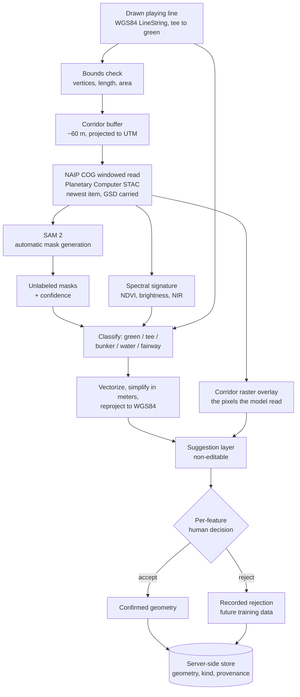

# AI Hole Feature Detection - Plan

## Goal Capsule

- **Objective:** Turn a contributor's drawn playing line into proposed polygons for the green, tee boxes, bunkers, water hazards, and fairway — segmented server-side from public-domain NAIP imagery, and confirmed one feature at a time by the contributor.
- **Product authority:** `docs/plans/2026-08-11-001-feat-osm-golf-course-mapper-plan.md` owns product scope and stays at `requirements-only`. This plan implements its deferred detection requirements (origin R5–R9).
- **Scope boundary:** The OpenStreetMap write path stays out (origin R14–R16). Nothing here uploads. Contributor decisions are captured to a server-side store instead, so the record accumulates while the upload path remains deferred.
- **Stop conditions:** Stop and ask if detection quality would require changing what a review step asks the contributor, or if per-feature human confirmation would need to be weakened for throughput.
- **Tail ownership:** No branch, PR, or deploy of the inference service is in scope beyond a working deployment target.

---

## Product Contract

### Summary

A contributor draws a hole's playing line, then asks for proposals. A server fetches NAIP imagery for a corridor around that line, runs SAM 2 to enumerate every mask in that corridor, classifies each mask by its spectral signature and its position along the line, and returns GeoJSON. The existing review sequence then walks the contributor through confirming each feature one at a time, and every decision — confirmed or rejected — is persisted for later review.

### Problem Frame

The app can locate a hole but cannot propose anything on it. The review sequence — is that the green, did we miss a bunker, which tee is which — exists and is unreachable, because nothing produces candidates. The playing-line flow is the only path that yields geometry, and it yields one line per hole.

That is the gap this closes, and the drawn line is what makes it tractable. Segmenting a whole course is expensive and imprecise; segmenting a 50–100 m corridor around a known playing line is bounded, and the line's own geometry supplies the strongest classification signal available — the green is at the far end, the tees are at the near end, everything else is in between.

Two constraints shape the architecture rather than decorate it. Esri's imagery grant covers tracing in an editor, not server-side inference, so detection must read different pixels than the contributor sees. And the tool's standing with the OSM community rests on per-feature human confirmation; proposals are suggestions, never edits.

### Requirements

**Detection**

- R1. A contributor with a drawn playing line can request feature proposals for that hole. (origin R5)
- R2. Detection runs server-side over public-domain NAIP imagery, never over the licensed display basemap. (origin R5)
- R3. Inference is bounded to a corridor around the drawn playing line, not the whole course.
- R4. Proposals cover green, tee boxes, bunkers, water hazards, and fairway. (origin R5)
- R5. Each proposal carries a feature kind, a confidence score, and the NAIP acquisition date it was derived from.
- R6. Scorecard facts constrain proposals: par shapes expectation, and the drawn line's endpoints anchor which mask is the green and which are tees. (origin R6, R8)

**Human validation**

- R7. No proposal reaches OpenStreetMap without explicit per-feature human confirmation. (origin R11, origin KD5)
- R8. Proposals render as a visually distinct suggestion layer, never as confirmed geometry.
- R9. The contributor can review proposals against the imagery the model actually saw, not only the display basemap.
- R10. Rejected proposals are recorded, not silently discarded, so they can seed later training.
- R14. A proposed water body is marked a hazard only on an explicit human answer that it is in play. Spectral classification proposes water; it never decides whether the water counts. (origin R9)

**Service**

- R11. The inference service exposes one typed endpoint taking a playing line and returning classified GeoJSON.
- R12. A detection request that fails or times out leaves the hole usable — the contributor can still map it by hand.
- R13. The service records its imagery source and acquisition date per response, for changeset provenance.
- R15. Confirmed and rejected features persist server-side with their geometry, classified kind, and imagery provenance, so the record survives the browser session and is reviewable later.

### Key Flows

- F1. Propose and confirm a hole's features
  - **Trigger:** Contributor finishes a playing line and asks for proposals.
  - **Steps:** The client sends the line; the service fetches a NAIP corridor, enumerates masks with SAM, classifies them, vectorizes and simplifies; the client renders them as suggestions; the review sequence walks each one for accept, reject, or "we missed one."
  - **Outcome:** A set of human-confirmed features on the hole, and a persisted record of what was rejected.
  - **Covered by:** R1, R3, R4, R5, R7, R8, R10, R14, R15

### Acceptance Examples

- AE1. **Covers R2.** Given a detection request, when the service fetches imagery, then it reads NAIP and never the Esri basemap, and the response names NAIP plus its acquisition year.
- AE2. **Covers R6.** Given a drawn line, when masks are classified, then the mask nearest the line's terminal point is proposed as the green and masks near the initial point as tees.
- AE3. **Covers R7, R8.** Given returned proposals, when they render, then they appear in the suggestion style and no proposal is marked confirmed until the contributor accepts it.
- AE4. **Covers R12.** Given the inference service times out, when the contributor is on the hole, then the failure is stated and the hole remains hand-mappable.
- AE5. **Covers R5, R9.** Given a proposal, when the contributor inspects it, then its confidence and the NAIP acquisition date are visible and they can display the corridor raster the service actually read, beneath the proposal.
- AE6. **Covers R14.** Given a proposed water body, when the contributor reaches its review step, then they are asked whether it is in play, and it is marked a hazard only on a yes.
- AE7. **Covers R6.** Given a hole whose scorecard lists four tee sets, when tee masks are classified, then each is matched to a tee set by its distance along the line against that set's yardage, and any tee set with no matching mask is surfaced as a possible missing tee.
- AE8. **Covers R15.** Given a contributor who confirms and rejects features on a hole and then navigates away, when the record is queried afterwards, then both the confirmations and the rejections are present with their geometry and classified kind.

### Scope Boundaries

**Deferred to follow-up work**

- Fine-tuning a semantic segmentation model on OSM-derived labels. The confirm/reject decisions this plan persists (U9) are the training set that makes it worthwhile later.
- OSM OAuth and changeset upload (origin R14–R16).
- Non-US courses — NAIP is US-only, so detection is US-only even though display is not.
- Cart paths, rough, driving range, and pins (origin's deferred deeper tags).

**Outside this plan**

- Batch or course-wide detection. Inference is per-hole, on request, bounded by a drawn line — this is deliberate, and it is what keeps the work defensible as assisted mapping rather than armchair mapping at scale.
- Any path that accepts proposals without per-feature human review.

### Dependencies / Assumptions

- Microsoft Planetary Computer serves NAIP as COGs via STAC. Metadata needs no account; asset reads need an anonymously-obtainable SAS token. No egress charge — the decisive advantage over the requester-pays AWS buckets.
- Planetary Computer exposes a single `naip` collection whose `image` asset is 4-band RGB+NIR for every year it carries. There is no separate analytic product to select — `naip-analytic`, `naip-visualization` and `naip-source` are AWS bucket names at the requester-pays provider, not Planetary Computer assets. NIR, which is what separates water from tree shadow and turf from sand, is therefore available unconditionally on this source.
- Planetary Computer's NAIP holdings end at 2023, and NAIP flies each state on a multi-year cadence, so the newest imagery for a given course may be several years old. Acquisition date is a correctness signal, not a footnote — courses are re-bunkered and re-grassed on that timescale.
- The collection stacks many years in one place with no default ordering, so item selection must be explicit or a request will read an arbitrary year at an arbitrary ground resolution.
- SAM 2 is class-agnostic — it returns masks, not labels. Classification is ours to build.
- Assumed: the playing line is drawn tee-to-green. The entire positional prior depends on it — a reversed line would invert the green and the tees.
- Assumed: greens, bunkers, and water segment well; **fairway-versus-rough is the known hard case**, since both are turf and mowing pattern is the only cue. The UI should set that expectation rather than shipping confident fairway polygons.
- Assumed: proposals derived from NAIP may visibly misalign with the Esri basemap the contributor sees — different acquisition dates and rectification. R9 exists because of this.

### Open Questions

**Deferred to implementation**

- Whether the SAM encoder runs server-side with the decoder in the browser via ONNX Runtime Web. That split would cut per-request cost sharply, but it complicates the contract; measure single-shot latency first.
- Corridor half-width. Start at 60 m and calibrate against real holes — too narrow clips greenside bunkers, too wide pulls in the neighbouring hole.
- What fields a persisted decision record may carry. R15 names geometry, classified kind, and imagery provenance; whether any contributor or session identifier is attached is undecided, and with a durable store that decision determines what the project is accumulating about its contributors.

**From the 2026-08-12 review**

- Where the corridor-raster overlay control lives, what it is labelled, and where the imagery-age warning appears. The map component currently treats imagery choice as configuration with no contributor-facing picker, and no toggle component exists in the design system, so this needs a design pass before U8 is built.

### Sources / Research

- [segment-geospatial (samgeo)](https://samgeo.gishub.org/samgeo2/) — SAM 2 with automatic mask generation over a GeoTIFF, GeoJSON out. Note its `SamGeo2` constructor validates `model_id` against a fixed list of the four SAM 2 checkpoints and rejects `sam2.1-*` ids.
- [SAM/SAM2 on aerial imagery](https://arxiv.org/html/2408.06970) — benchmarks at finer resolution than NAIP; its load-bearing finding for us is that prompt strategy, not model version, drives accuracy at low resolution.
- [Planetary Computer SAS](https://planetarycomputer.microsoft.com/docs/concepts/sas/) — anonymous token flow for NAIP COG reads.
- [NAIP on AWS Open Data](https://registry.opendata.aws/naip/) — the three buckets and their band content; requester-pays.
- [rasterio features](https://rasterio.readthedocs.io/en/stable/topics/features.html) — `shapes` + `transform_geom`, the canonical raster→vector path.
- [topojson](https://github.com/mattijn/topojson) — `toposimplify` preserves shared boundaries between touching polygons, avoiding slivers. Maintained and Shapely 2 compatible, unlike `rastachimp` (2019 alpha, incompatible with the Shapely 2 that samgeo's dependency chain requires).
- [Facebook AI-Assisted Road Tracing](https://wiki.openstreetmap.org/wiki/Facebook_AI-Assisted_Road_Tracing) — the precedent pipeline and its explicit per-feature human-review commitment.
- [Modal pricing](https://modal.com/pricing) — per-second billing, $30/mo free credits.

---

## Planning Contract

### Key Technical Decisions

- KTD1. **Inference runs server-side, and every proposal requires per-feature human confirmation.** (session-settled: user-directed — chosen over browser-side inference and the previous no-backend posture: server-side inference is acceptable given humans validate it.) This reopens the prior plan's no-backend choice, which was explicitly scoped as slice-local. Governs R2, R7, R11.
- KTD2. **SAM 2 via `segment-geospatial`, in automatic mask-generation mode, not a trained segmentation model.** No labeled training set exists, and golf features suit SAM — high-contrast, closed, compact. samgeo also reads the GeoTIFF and emits GeoJSON, collapsing three steps into one library. Automatic generation rather than prompting is load-bearing: a prompt disambiguates one object, so points along the playing line and a box around the corridor would return the corridor and its on-line features while never reaching a bunker or pond sitting off the line. Automatic generation is also the only samgeo path returning per-mask `predicted_iou` and `stability_score`. Pin `facebook/sam2-hiera-large` — the newest checkpoint `SamGeo2` accepts, since it rejects `sam2.1-*` ids outright. Governs R4.
- KTD3. **Classification is ours, not the model's.** SAM returns unlabeled masks. Classify with spectral rules over NAIP's 4 bands — bunker is high visible/low NDVI, water is low NIR and low brightness, turf is high NDVI — then disambiguate green from fairway by position along the drawn line, and match tee masks to scorecard tee sets by distance along that line. This is the highest-leverage and cheapest part of the system, and it is where the drawn line earns its keep now that the line no longer prompts the model. Governs R4, R6.
- KTD4. **NAIP for inference, Esri for display — permanently separate.** Esri's OSM grant covers tracing in an editor, not server-side inference or redistribution. Carried from the prior plan's KTD4. Governs R2, R9.
- KTD5. **NAIP via Planetary Computer STAC with a windowed COG read, newest item wins.** Native resolution, includes NIR, carries an acquisition date, and has no egress charge. The collection stacks many years with no default ordering, so the search sorts by acquisition date descending and takes one item; its ground resolution travels with the raster, because absolute area filters and pixel-based simplification tolerances are both silently wrong when resolution varies between requests. The USGS `exportImage` endpoint is the fallback for a spike — simpler, but no NIR by default and no version pinning. Governs R2, R5, R13.
- KTD6. **Modal for serving, spawn-and-poll rather than a synchronous call.** Per-second billing with scale-to-zero and $30/mo free credits puts a handful of users effectively at zero. Always-on endpoints and Lambda's size limits both fit this workload badly. The call is asynchronous because Modal caps web requests at 150 s and past that issues a redirect its own docs say does not work with CORS — a scale-to-zero GPU container paying boot, torch import, CUDA init and checkpoint load can approach that, so a synchronous call would surface a cold start as a transport error rather than the typed timeout R12 promises. Governs R11, R12.
- KTD7. **Simplify in meters, in the projected CRS, before reprojecting to WGS84.** Douglas-Peucker in degrees is the classic bug — the same tolerance means different distances at different latitudes. Use `topojson`'s `toposimplify` for topology-aware simplification so touching features do not develop slivers; `rastachimp` cannot be used, as it is a 2019 alpha incompatible with the Shapely 2 that samgeo requires. Governs R4.
- KTD8. **Proposals render as a distinct, non-editable suggestion layer** until accepted, mirroring RapiD. This is the pattern the OSM community already accepts, and it is what keeps the work outside Automated Edits territory. Governs R7, R8.
- KTD9. **Rejections are recorded.** The confirm/reject UI is a free labeling pipeline; every decision is a training example for the fine-tuned model this plan defers. Governs R10.
- KTD10. **Decisions persist to a server-side store, not the browser session.** Confirmations and rejections both land in a database with their geometry, classified kind, and imagery provenance. This is what makes KTD9's labeling-pipeline argument real rather than notional — browser-session state is cleared on hole navigation, so a session-only record would hold one hole at most. It also decouples capturing contributor work from shipping the OpenStreetMap write path: the record accumulates now and the upload path consumes it whenever it lands. Governs R10, R15.
- KTD11. **Production runs behind an authenticating identity proxy; the endpoint is not public.** Access control lives at the proxy rather than in the service, so the service itself carries no auth logic. Permissive CORS applies to local development only. This does not remove the need for input bounds — an authenticated contributor can still send a corridor large enough to exhaust the container. Governs R11.

### High-Level Technical Design

Detection pipeline, from drawn line to confirmed feature:

The line does double duty. It bounds the corridor, and it supplies the positional prior that turns class-agnostic masks into labeled features: the mask at the terminal end is the green, masks clustered at the initial end are tees matched to scorecard tee sets by distance along the line, and everything else classifies spectrally. What the line does *not* do is prompt the model — SAM enumerates the corridor on its own, because a prompt would only ever return what sits under it.

---

## Implementation Units

### U0. Service environment and packaging

- **Goal:** A reproducible Python environment the service units can be written and tested in.
- **Requirements:** Enables R2, R3, R11
- **Dependencies:** None
- **Files:** `.devcontainer/devcontainer.json`, `.devcontainer/Dockerfile`, `service/pyproject.toml`, `service/tests/conftest.py`
- **Approach:**
  1. Add a devcontainer carrying the full Python toolchain, so the environment is declared once and identical for every contributor rather than reconstructed per machine.
  2. Pin the service's dependencies in `service/pyproject.toml`: `segment-geospatial`, `rasterio`, `pystac-client`, `planetary-computer`, `topojson`, and a torch build appropriate to the container.
  3. Derive the Modal deployment image in U5 from the same pinned manifest, so the local and deployed environments cannot drift.
  4. Add the pytest configuration and shared fixtures the service tests use.
- **Execution note:** The repository is a Vite/React project with no Python present today. This unit is what makes `pytest service/` a runnable gate rather than an aspiration.
- **Test scenarios:**
  - `pytest service/` runs and collects zero tests without error in a fresh container.
  - The pinned Shapely major version satisfies both `segment-geospatial` and `topojson`.
- **Verification:** A fresh devcontainer build imports `samgeo`, `rasterio` and `topojson` without error.

### U1. NAIP corridor fetch

- **Goal:** Given a playing line, return a georeferenced 4-band raster covering its corridor.
- **Requirements:** R2, R3, R13
- **Dependencies:** U0
- **Files:** `service/naip.py`, `service/tests/test_naip.py`
- **Approach:**
  1. Bounds-check the incoming line before any other work: reject lines exceeding fixed caps on vertex count, total geodesic length, and resulting corridor bbox area (start at 200 vertices, 1,200 m, 1 km²) with the typed validation error U5 returns. A golf hole gives natural limits, so the caps cost no legitimate use — and they run before buffering so an oversized request never reaches a STAC query or a COG read.
  2. Buffer the WGS84 line by the corridor half-width, projected to the local UTM zone so the buffer is in meters.
  3. Query Planetary Computer STAC for `naip` items intersecting the bbox, **sorted by `properties.datetime` descending, and take the single newest**; sign asset hrefs with an anonymously-obtained SAS token.
  4. Windowed-read that item's `image` asset for just the bbox at native resolution. The asset is 4-band RGB+NIR for every year Planetary Computer carries, so there is no product to select between.
  5. Return the array, its transform, its CRS, the item's acquisition date, and its `properties.gsd` — U3's area filters and U4's pixel-based tolerance both need the actual ground resolution, which varies between items.
- **Test scenarios:**
  - A line in Nebraska and one in California each resolve to their own UTM zone, not a shared one.
  - The returned raster's bounds contain the buffered corridor.
  - The acquisition date is carried through from STAC item metadata.
  - Given several overlapping items spanning multiple years, the newest is the one read, and its ground resolution is returned alongside the raster.
  - A line whose buffered corridor exceeds the area cap returns the typed validation error before any STAC query or COG read.
  - A bbox with no NAIP coverage returns a stated no-coverage result rather than an empty array.
  - A SAS token failure surfaces as a typed error, not a raw exception.
- **Verification:** A known Pebble Beach hole returns a raster whose bounds contain its playing line, with a plausible acquisition year and a stated ground resolution.

### U2. SAM segmentation over the corridor

- **Goal:** Produce unlabeled masks with confidence scores for the corridor.
- **Requirements:** R4, R5
- **Dependencies:** U0, U1
- **Files:** `service/segment.py`, `service/tests/test_segment.py`
- **Approach:**
  1. Run SAM 2 through `segment-geospatial` in **automatic mask-generation mode** over the corridor raster, enumerating every mask in the corridor. Do not prompt with the drawn line: a prompt returns the object beneath it, so line-derived points and a corridor box would return the corridor and its on-line features while never reaching a bunker or pond off the line. The drawn line is a U3 classification prior, not a model input.
  2. Keep SAM's `predicted_iou` and `stability_score` per mask — these become the confidence surfaced in the UI. Automatic generation is also the only samgeo path that returns both.
  3. Apply a morphological open/close before returning, to kill single-pixel noise.
- **Execution note:** Pin `facebook/sam2-hiera-large`. `SamGeo2` validates `model_id` against a fixed list of the four SAM 2 checkpoints and raises on any `sam2.1-*` id, so the 2.1 line is not loadable through this library — pinning explicitly is what stops a silent substitution changing output quality without any code change of yours.
- **Test scenarios:**
  - A synthetic raster with one bright blob returns one mask covering it.
  - A synthetic raster with a blob well away from the drawn line still returns a mask for it.
  - Confidence scores are carried through per mask.
  - Single-pixel noise is removed by the morphological pass.
  - An all-uniform raster returns no masks rather than one mask covering everything.
- **Verification:** A real hole corridor returns masks that visually correspond to its green and bunkers, including bunkers set off the playing line.

### U3. Feature classification

- **Goal:** Turn unlabeled masks into typed features.
- **Requirements:** R4, R6
- **Dependencies:** U0, U2
- **Files:** `service/classify.py`, `service/tests/test_classify.py`
- **Approach:**
  1. Compute per-mask spectral statistics from the 4-band raster: NDVI, visible brightness, NIR level.
  2. Classify by rule — bunker is high visible brightness with low NDVI; water is low NIR and low brightness; turf is high NDVI.
  3. Reject a line whose terminal point is nearer the tee complex than its initial point with a stated error. The positional prior below assumes tee-to-green ordering, and a reversed line would silently invert the green and the tees — the most confident-looking wrong answer the system can produce.
  4. Split turf by position along the line: the mask containing or nearest the terminal point is the green; masks near the initial point are tees; the largest remaining elongated turf mask is the fairway.
  5. Match each tee mask to a scorecard tee set by its distance along the playing line against that set's yardage, and carry the assignment on the proposal so the tee review step opens prefilled rather than blank. Surface any tee set with no matching mask as a possible missing tee. Handle a tee-mask count that differs from the scorecard's tee-set count — the client's tee identifier list is fixed at four entries, so an unmatched mask must degrade to an unassigned tee rather than overflow it.
  6. Apply area sanity filters using the ground resolution U1 returned, not a hardcoded pixel size — a green runs roughly 250–2,500 m² and a bunker roughly 40–1,900 m². These ranges come from measured course geometry: greens at the Old Course average around 2,069 m² and documented bunkers span from a few square metres to well over a thousand, so narrower bounds discard correct features. Treat an out-of-range mask as a **confidence penalty, not a drop**, so it still reaches the contributor as a low-confidence proposal.
- **Test scenarios:**
  - Covers AE2. A mask at the line's terminal point classifies as green, and masks at the initial point as tees.
  - Covers AE7. Tee masks are assigned to scorecard tee sets by distance along the line, and a tee set with no mask is surfaced as possibly missing.
  - A line drawn green-to-tee is rejected with a stated error rather than inverting the green and tee labels.
  - A high-brightness low-NDVI mask classifies as bunker, not green.
  - A low-NIR dark mask classifies as water, not shadow-covered turf.
  - A 5,000 m² mask is returned as a low-confidence green rather than dropped.
  - Two turf masks at the terminal end resolve to exactly one green.
  - A corridor with no water returns no water features rather than a forced one.
- **Verification:** On a hole with a known layout, the green, bunkers, and water classify correctly and the tees carry their scorecard assignment; fairway is expected to be the weakest.

### U4. Vectorize and simplify

- **Goal:** Convert classified masks into mappable WGS84 GeoJSON.
- **Requirements:** R4
- **Dependencies:** U0, U3
- **Files:** `service/vectorize.py`, `service/tests/test_vectorize.py`
- **Approach:**
  1. Vectorize masks in the raster CRS with `rasterio.features.shapes`.
  2. Simplify in meters, in the projected CRS, at a tolerance of roughly one to two pixels — never in degrees. Derive the pixel size from the ground resolution U1 returned rather than assuming it, since items differ.
  3. Use `topojson`'s `toposimplify` for topology-aware simplification so features that touch do not develop slivers or overlaps. Not `rastachimp` — it is a 2019 alpha whose own tests fail against the Shapely 2 that samgeo's dependency chain requires, so the two cannot be installed together.
  4. Reproject to WGS84 last, and cap each proposal at 80 vertices — raising the simplification tolerance until it fits — so proposals are mappable rather than 400-node blobs.
- **Test scenarios:**
  - A staircase pixel boundary simplifies to a low-vertex polygon.
  - Two touching masks simplify without producing a sliver gap between them.
  - Simplification happens before reprojection — a polygon at high latitude simplifies to the same shape as the equivalent one at low latitude.
  - Output coordinates are WGS84 in `[longitude, latitude]` order.
  - A polygon exceeding the vertex cap is simplified further rather than returned.
- **Verification:** Output loads in a GeoJSON viewer at the right place on earth with mappable vertex counts.

### U5. Inference endpoint

- **Goal:** One typed endpoint the client can call.
- **Requirements:** R11, R12, R13, R15
- **Dependencies:** U0, U1, U2, U3, U4, U9
- **Files:** `service/app.py`, `service/tests/test_app.py`, `service/modal_deploy.py`
- **Approach:**
  1. Accept a WGS84 LineString plus the hole's par and card yardage; return typed GeoJSON features with kind, confidence, and imagery provenance. Bound the par and yardage values alongside the line's geometry — they feed classification thresholds.
  2. Return the corridor raster the model actually read alongside the features: a signed reference plus its WGS84 bounds and acquisition date, so U8 can render the exact pixels inference used rather than a different NAIP product.
  3. Deploy on Modal with scale-to-zero, building the image from U0's pinned manifest and baking the model checkpoint in rather than downloading at request time.
  4. **Spawn and poll rather than answering synchronously.** The request enqueues a job and returns a call reference; the client polls it. Modal caps web requests at 150 s and redirects past that in a way incompatible with CORS, and a cold container spends tens of seconds on boot, torch import, CUDA init and checkpoint load before inference starts — so a synchronous call would surface a cold start as a transport error rather than the typed timeout R12 requires. Budget 60 s end-to-end for a warm request and treat 150 s as the hard ceiling never to be approached.
  5. Return a typed **no-coverage** result when U1 reports no NAIP item for the bbox or U2 returns zero masks. Success, validation error, and timeout do not cover either case, and without its own variant a legitimately empty answer is indistinguishable from a failure.
  6. Persist the returned proposals and, on confirmation, the contributor's decisions through U9's store.
  7. Production sits behind an authenticating identity proxy, so the service carries no auth logic of its own; permissive CORS applies to local development only. Note the endpoint URL is not a secret in either case — the client convention ships service base URLs in the browser bundle.
- **Test scenarios:**
  - A valid line returns features carrying kind, confidence, and NAIP acquisition date.
  - A malformed line returns a typed validation error, not a 500.
  - A line exceeding the corridor bounds caps returns the typed validation error without an imagery read.
  - A request exceeding the budget returns the typed timeout result through the poll path, not a transport error.
  - A bbox with no NAIP coverage returns the typed no-coverage result.
  - The response includes the imagery source string and the corridor raster reference for changeset provenance and review.
- **Verification:** A deployed endpoint answers a real hole's line with plausible features, and a cold-start request returns through the poll path rather than failing in transport.

### U6. Request proposals from the client

- **Goal:** Let a contributor ask for proposals once their line is drawn.
- **Requirements:** R1, R12
- **Dependencies:** U5
- **Files:** `src/api/detect.ts`, `src/api/detect.test.ts`, `src/screens/ReviewScreen.tsx`, `src/state/useMapper.ts`
- **Approach:**
  1. Add a typed client mirroring the `src/api/opengolf.ts` result-union pattern — the repo's established convention for a fallible call — carrying the success, validation-error, no-coverage, and timeout variants U5 returns.
  2. Offer the request only once a line is finished, then poll the job reference U5 returns while showing a working state.
  3. Make the working state cancellable: a manual cancel stops the polling loop and returns the hole to the same hand-mappable state the timeout path gives. The first request of a session is the one most likely to be slow, and waiting out a cold start with no alternative is the case R12 does not otherwise cover.
  4. Render the no-coverage result as its own state, modelled on the empty branch in `src/screens/SearchScreen.tsx`, stating that no proposals were produced — detection silence and detection failure must not look alike.
  5. On failure or timeout, state it and leave the hole hand-mappable per R12.
- **Patterns to follow:** `src/api/opengolf.ts` for the result union; `src/screens/SearchScreen.tsx` for the render discipline, including its distinction between an empty result and a failed one.
- **Test scenarios:**
  - Covers AE4. A timeout renders a stated failure and leaves the hole usable.
  - The request is unavailable until the line is finished.
  - Cancelling during the working state stops polling and returns the hole to hand-mappable.
  - A no-coverage response renders its own stated message rather than an empty review sequence.
  - A successful response transitions the hole into the review sequence.
  - A network rejection resolves to the failed variant, not a thrown exception.
- **Verification:** Drawing a line and requesting proposals returns features into the review flow, and a cancelled request leaves the hole workable.

### U7. Suggestion layer and per-feature confirmation

- **Goal:** Render proposals as suggestions and walk the contributor through confirming each.
- **Requirements:** R7, R8, R10, R14, R15
- **Dependencies:** U6, U9
- **Files:** `src/screens/ReviewScreen.tsx`, `src/state/useMapper.ts`, `src/state/useMapper.test.ts`, `src/data/course.ts`
- **Approach:**
  1. Add a `proposed` feature status alongside pending/active/confirmed as an **explicit case** in the `STATUS_COLOR` and `STATUS_WIDTH` match expressions, with its own hue and a dashed line. Do not rely on the expressions' fallback branch — it is hardcoded to the confirmed colour, so an unhandled status would render proposals as confirmed geometry, which is exactly what R8 forbids. Add a fourth entry to the map legend for it.
  2. Rework the review sequence to confirm **one proposal at a time**. Today `Step.targets` is a fixed list, `accept()` concatenates every target of the step at once, and `reject()` drops only the last — so a variable-length proposal list cannot express per-feature confirmation. Replace `targets` with a per-step feature kind, derive the reviewable list from the returned proposals at runtime, and rewrite `accept`/`reject` to act on a single active proposal and advance within the step before advancing the step. Template the step copy off the actual proposal count rather than the hardcoded "We found 2 bunkers on this hole."
  3. **Retain steps with zero proposals** rather than skipping them, using the empty-target pattern the existing `extras` step already uses — step shown, add action live. Skipping makes detection silence and genuine absence look identical and removes the only route to "we missed one", which F1 names as one of the three outcomes.
  4. Add a **water in-play step**: a proposed water body is marked a hazard only on an explicit yes, per R14. Spectral classification proposes water; whether it is in play is a golf judgment the origin reserves for the human.
  5. Add an **Other Hazards step** for hazards outside the five detected kinds. This is a contributor-add step with no detection class behind it — it does not imply an unmet detection requirement.
  6. Record rejections with their geometry and classified kind per R10, in a course-level collection that neither `openHole` nor `go('review')` clears, keyed by hole number. This is an in-session cache in front of U9's store, not the system of record — every state slot that could hold rejections is reset on navigation today, so without it only the last hole survives.
- **Patterns to follow:** The MapLibre `match`-expression styling already driving feature status in `src/screens/ReviewScreen.tsx`; the zero-target `extras` step in `src/data/course.ts`.
- **Test scenarios:**
  - Covers AE3. Proposals render in the suggestion style and none is confirmed until accepted.
  - A proposal with an unhandled status does not inherit the confirmed colour.
  - Accepting one proposal confirms only that proposal and advances to the next within the step.
  - Rejecting a proposal records it with its kind and geometry.
  - Covers AE6. A proposed water body is marked a hazard only after an explicit in-play answer.
  - A hole with no proposals for a step still shows that step with its add action available.
  - Covers AE8. A rejection survives navigating to another hole and back.
  - Keyboard accept/reject shortcuts operate on the active proposal.
- **Verification:** A hole with proposals walks the full accept/reject sequence one feature at a time, and rejections are retrievable after navigating away.

### U8. Provenance and confidence in the UI

- **Goal:** Let the contributor judge a proposal against what the model actually saw.
- **Requirements:** R5, R9
- **Dependencies:** U7
- **Files:** `src/screens/ReviewScreen.tsx`, `src/map/BaseMap.tsx`, `src/map/imagerySources.ts`
- **Approach:**
  1. Surface each proposal's confidence and the NAIP acquisition **year** in the review rail — always visible, not only on a warning.
  2. Render the **corridor raster U5 returned** as a georeferenced overlay beneath the proposals, toggled on demand. This is not the existing `usgs-naip` basemap: that source is a live USGS NAIPPlus `exportImage` mosaic with no pinned version and no per-tile acquisition date, while inference reads one dated Planetary Computer item, so toggling the basemap would show the contributor different pixels than the model read and satisfy neither R9 nor AE5.
  3. Warn explicitly only when the inference imagery is more than three years old. Planetary Computer's holdings end at 2023 and NAIP flies each state on a multi-year cadence, so a warning framed as an exception would fire on nearly every proposal and be learned into invisibility.
- **Test scenarios:**
  - A proposal's confidence and acquisition year render in the rail.
  - Displaying the corridor overlay shows the raster the service read, positioned under the proposals, without rebuilding the map.
  - A proposal derived from imagery more than three years old carries the age warning; a newer one shows the year without a warning.
- **Verification:** Displaying the corridor overlay visibly changes the imagery under an unchanged proposal, and the imagery shown matches the acquisition date in the rail.

### U9. Decision store

- **Goal:** Confirmations and rejections survive the browser session and are reviewable later.
- **Requirements:** R10, R15
- **Dependencies:** U0
- **Files:** `service/store.py`, `service/models.py`, `service/tests/test_store.py`, `service/migrations/`
- **Approach:**
  1. Persist one record per contributor decision: hole identity, feature kind, geometry, the accept-or-reject outcome, the proposal's confidence, and the imagery provenance the proposal derived from.
  2. Expose write and read paths through U5 so the client never talks to the store directly.
  3. Scope the record's fields deliberately — see the open question on whether any contributor or session identifier is attached. With a durable store this decides what the project accumulates about its contributors, so it is a decision to make before the first write, not after.
- **Execution note:** This is what makes KTD9's labelling-pipeline argument real. It also decouples capturing contributor work from shipping the OpenStreetMap write path, which stays deferred: the record accumulates now and the upload path consumes it whenever it lands.
- **Test scenarios:**
  - A confirmed feature and a rejected proposal on the same hole both persist with geometry and kind.
  - Records survive across sessions, not only across hole navigation.
  - Imagery provenance is stored alongside each decision, so a later training run can filter by acquisition year.
- **Verification:** Confirming and rejecting features on a hole, then querying the store in a fresh session, returns both decisions with their geometry.

---

## Verification Contract

| Gate | Command | Applies to |
|---|---|---|
| Service tests | `pytest service/` | U1–U5, U9 |
| Client type check and build | `npm run build` | U6–U8 |
| Client unit tests | `npm run test` | U6–U8 |
| Render smoke | `npm run smoke` | U6–U8 |
| Live endpoint check | deployed URL against a known hole | U5 |
| Persistence check | decisions on a hole readable from a fresh session | U9 |

`pytest service/` runs inside U0's devcontainer — there is no Python environment in this repository without it.

The existing `npm run test` and `npm run smoke` gates must keep passing — U7 changes the review screen that both exercise.

## Definition of Done

- A contributor can draw a playing line, request proposals, and see typed features appear as suggestions.
- Proposals carry a feature kind, a confidence score, and the NAIP acquisition date.
- No proposal can reach confirmed state without an explicit per-feature human decision — one proposal at a time, never a whole step at once.
- A proposed water body is marked a hazard only on an explicit in-play answer.
- Confirmations and rejections persist server-side with geometry and kind, and are readable from a fresh session.
- The contributor can display the corridor raster the model actually read, beneath the proposals.
- A step with no proposals is still shown, so a missed feature can be added.
- Detection failure, timeout, or no imagery coverage each leaves the hole hand-mappable and says which occurred.
- Inference reads NAIP only; the Esri basemap is never sent to the model.
- All Verification Contract gates pass.
- No abandoned experimental code remains in the service or client diff.
